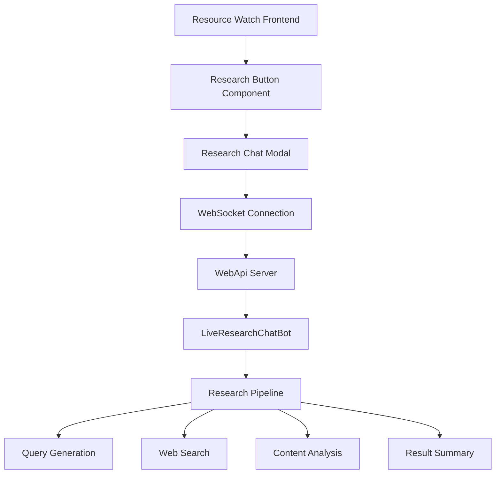

# Design Document

## Overview

This design document outlines the integration of the existing LiveResearchBot functionality from the WebResearchTool project into the Resource Watch application. The integration will reuse the existing backend services and frontend components while adapting them to work within the Resource Watch ecosystem.

## Architecture

### High-Level Architecture



### Integration Points

1. **Frontend Integration**: Add research functionality to the Resource Watch explore page
2. **Backend Integration**: Connect to the existing WebApi server running the LiveResearchBot
3. **Communication Layer**: Establish WebSocket connection for real-time research updates
4. **UI Integration**: Create a modal-based chatbot interface that fits Resource Watch design

## Components and Interfaces

### Frontend Components

#### 1. ResearchButton Component
- **Location**: `components/research/research-button`
- **Purpose**: Floating action button to trigger research functionality
- **Props**:
  - `onClick`: Function to open research modal
  - `className`: Optional styling classes
- **Styling**: Positioned as floating button, Resource Watch theme colors

#### 2. ResearchChatModal Component
- **Location**: `components/research/research-chat-modal`
- **Purpose**: Modal container for the research chatbot interface
- **Props**:
  - `isOpen`: Boolean to control modal visibility
  - `onClose`: Function to close modal
- **Features**:
  - Full-screen modal on mobile, centered modal on desktop
  - Resource Watch styling and branding
  - Close button and escape key handling

#### 3. LiveResearchChatBot Component (Adapted)
- **Location**: `components/research/live-research-chatbot`
- **Purpose**: Main chatbot interface adapted from WebApp
- **Adaptations**:
  - Remove Lit framework dependencies
  - Convert to React component
  - Integrate with Resource Watch styling
  - Use Resource Watch's WebSocket patterns

#### 4. ResearchServerApi Service
- **Location**: `services/research-api.js`
- **Purpose**: API service for communicating with WebApi backend
- **Methods**:
  - `conversation()`: Send research requests
  - `getChatLog()`: Retrieve chat history
  - `establishWebSocket()`: Create WebSocket connection

### Backend Components (Reused)

#### 1. WebApi Server
- **Location**: `webApi/src/server.ts`
- **Status**: Reused as-is
- **Port**: 5029 (configurable)
- **Features**: Existing LiveResearchChatController and WebSocket handling

#### 2. LiveResearchChatBot
- **Location**: `webApi/src/liveResearchChatBot.ts`
- **Status**: Reused with minor configuration changes
- **Modifications**:
  - Update research schema for environmental focus
  - Adjust query generation prompts for Resource Watch context
  - Remove hardcoded "New Jersey" location filter

#### 3. Research Pipeline Agents
- **Status**: Reused as-is from @policysynth/agents
- **Components**:
  - SearchQueriesGenerator
  - SearchQueriesRanker
  - ResearchWeb
  - SearchResultsRanker
  - WebPageScanner

## Data Models

### Chat Message Interface
```typescript
interface PsSimpleChatLog {
  sender: 'user' | 'assistant';
  message: string;
  timestamp?: Date;
}
```

### Research Request Interface
```typescript
interface ResearchRequest {
  wsClientId: string;
  chatLog: PsSimpleChatLog[];
  numberOfSelectQueries: number;
  percentOfTopQueriesToSearch: number;
  percentOfTopResultsToScan: number;
  memoryId?: string;
}
```

### WebSocket Message Interface
```typescript
interface WebSocketMessage {
  type: 'agent_start' | 'agent_update' | 'agent_completed' | 'chat_response';
  data: any;
  clientId?: string;
}
```

## Error Handling

### Connection Management
- **WebSocket Reconnection**: Automatic reconnection with exponential backoff
- **API Timeout Handling**: 30-second timeout for research requests
- **Error Display**: User-friendly error messages in chat interface

### Graceful Degradation
- **Backend Unavailable**: Show offline message with retry option
- **Research Failures**: Display error message and allow retry
- **Network Issues**: Queue messages and retry when connection restored

### Error States
1. **Connection Failed**: "Unable to connect to research service"
2. **Research Timeout**: "Research is taking longer than expected"
3. **API Error**: "An error occurred during research"
4. **Invalid Response**: "Received invalid response from server"

## Testing Strategy

### Unit Tests
- **Component Testing**: React Testing Library for all new components
- **Service Testing**: Jest tests for ResearchServerApi
- **WebSocket Testing**: Mock WebSocket connections

### Integration Tests
- **End-to-End**: Cypress tests for complete research workflow
- **API Integration**: Test communication with WebApi backend
- **Modal Behavior**: Test modal open/close and state management

### Manual Testing
- **Cross-Browser**: Chrome, Firefox, Safari, Edge
- **Responsive Design**: Mobile, tablet, desktop viewports
- **Research Pipeline**: Test various research queries and responses

## Security Considerations

### API Security
- **CORS Configuration**: Allow Resource Watch domain for WebApi
- **Rate Limiting**: Implement request throttling for research endpoints
- **Input Validation**: Sanitize user input before processing

### WebSocket Security
- **Origin Validation**: Verify WebSocket connection origins
- **Message Validation**: Validate all incoming WebSocket messages
- **Connection Limits**: Limit concurrent WebSocket connections per user

### Data Privacy
- **Chat History**: Store chat logs temporarily with automatic cleanup
- **User Data**: No personal information stored in research context
- **External APIs**: Ensure compliance with third-party API terms

## Performance Considerations

### Frontend Optimization
- **Code Splitting**: Lazy load research components
- **Bundle Size**: Minimize additional dependencies
- **Memory Management**: Proper cleanup of WebSocket connections

### Backend Optimization
- **Connection Pooling**: Reuse WebSocket connections efficiently
- **Caching**: Cache research results for similar queries
- **Resource Limits**: Set limits on concurrent research operations

### Monitoring
- **Performance Metrics**: Track research completion times
- **Error Rates**: Monitor API and WebSocket error rates
- **Usage Analytics**: Track research feature adoption

## Deployment Strategy

### Development Environment
- **Local Setup**: Run WebApi server alongside Resource Watch
- **Environment Variables**: Configure WebApi URL and ports
- **Hot Reloading**: Support development workflow

### Production Environment
- **Service Deployment**: Deploy WebApi as separate service
- **Load Balancing**: Handle multiple WebSocket connections
- **Health Checks**: Monitor WebApi service availability

### Configuration Management
- **Environment Variables**:
  - `RESEARCH_API_URL`: WebApi server URL
  - `RESEARCH_WS_PORT`: WebSocket port
  - `RESEARCH_ENABLED`: Feature flag for research functionality
- **Feature Flags**: Allow enabling/disabling research feature