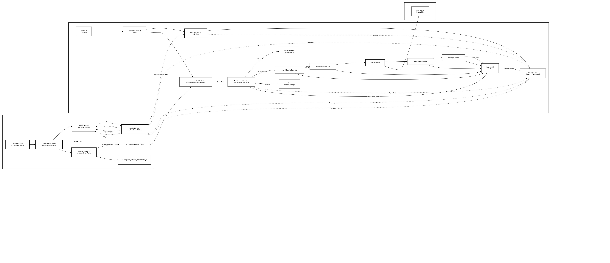

# System Architecture & Technical Implementation

## Overview

Polisense.AI implements a **hybrid architecture** that combines a custom AI-powered backend with an open-source data visualization platform. The system architecture follows a **microservices pattern** with clear separation between data processing, AI analysis, and user interface layers.

## High-Level Architecture

Our implementation leverages two main components:

1. **Custom AI Backend (webApi)** - Express.js server providing AI research capabilities
2. **ResourceWatch Frontend** - Next.js application for data visualization and exploration

### System Architecture Diagram



The architecture demonstrates how Polisense.AI integrates diverse external data sources with AI processing capabilities:

**External Data Connectors:**
- **MAIIA EI BID Informality data** - Economic informality indicators
- **EIA Energy Access Data** - Energy Information Administration datasets  
- **NASA Nightlights geospatial data** - Satellite-based lighting analysis
- **ClimateTrace Emissions** - Climate emissions tracking data

**Software Architecture Components:**
- **Polisense UI** - User interface for policy research and analysis
- **Polisense Backend API** - Core backend orchestrating data flow and AI processing
- **Data Storage** - Centralized data repository for all external datasets
- **AI RAG** - Retrieval Augmented Generation system for intelligent data analysis
- **Multi-modal AI model** - Advanced AI processing satellite and emissions data
- **ResourceWatch Open-Source Backend** - Integration with existing data visualization platform

## Cloud-Based Deployment Architecture


The cloud deployment architecture shows Polisense.AI operating within a cloud environment, processing multiple data inputs and delivering outputs to local government systems:

**Input Data Sources:**
- Nightlight data
- Global irradiance measurements
- Power infrastructure mapping
- Population density analysis
- Economic sectors data

**Output Deliverables:**
- Reports
- Metrics
- Structured data
- Conversational answers

**Government Integration:**
- Middleware for Government ERP Systems
- Direct integration with existing government infrastructure

## Technical Implementation Details

### Backend Architecture (webApi)

**Core Technologies:**
- **Express.js** - RESTful API server framework
- **TypeScript** - Type-safe development
- **WebSocket** - Real-time communication
- **PostgreSQL** - Primary relational database
- **Redis** - Session management and caching
- **Weaviate** - Vector database for RAG system

**Key Components:**

1. **PolicyResearchController** (`webApi/src/controllers/policyResearchController.ts`)
   - Handles live research chat functionality
   - Manages WebSocket connections for real-time updates
   - Processes policy research requests
   - Integrates with AI agents for data analysis

2. **AI Research Pipeline:**
   - **SearchQueriesGenerator** - Generates relevant search queries using OpenAI
   - **SearchQueriesRanker** - Ranks queries via LLM pairwise comparison
   - **ResearchWeb** - Interfaces with Google/Bing APIs
   - **SearchResultsRanker** - Scores results using GPT
   - **WebPageScanner** - Scrapes and extracts webpage content

3. **Real-time Communication:**
   - WebSocket server for live streaming of AI responses
   - Token usage and cost tracking
   - Status updates for research progress

### Frontend Architecture (ResourceWatch)

**Core Technologies:**
- **Next.js** - React framework with SSR/SSG capabilities
- **React** - User interface components
- **Redux** - State management
- **Mapbox GL + Deck.gl** - Geospatial visualization
- **Material-UI** - Component library

**Key Features:**

1. **Data Visualization Pipeline:**
   - Integration with Google Earth Engine (GEE) for satellite data
   - Real-time map rendering with interactive layers
   - Support for multiple data formats (raster tiles, time series, metadata)

2. **API Integration:**
   - ResourceWatch API (`api.resourcewatch.org`)
   - Dataset management and querying
   - Layer configuration and widget rendering

3. **User Interface Components:**
   - Interactive maps with multiple layer support
   - Data exploration tools
   - Dashboard creation and customization

## Data Flow Architecture

### ResourceWatch Data Pipeline

The system implements a sophisticated data pipeline that processes information from multiple sources:

```
External Data Sources → API Layer → Frontend App → Map Rendering
```

**Data Processing Stages:**

1. **Data Ingestion** - Collects satellite data, census information, infrastructure maps
2. **API Processing** - ResourceWatch API handles data transformation and querying
3. **Frontend State Management** - Redux manages application state and user interactions
4. **Visualization** - Mapbox GL and Deck.gl render interactive geospatial visualizations

### AI Research Workflow

The AI research system follows a sequential pipeline:

```
User Input → Query Generation → Web Search → Content Analysis → AI Summarization
```

**Research Pipeline Components:**

1. **Initial Setup** - WebSocket connection establishment
2. **User Interaction** - HTTP API calls for research requests
3. **Backend Processing** - AI agent orchestration
4. **Real-time Updates** - WebSocket streaming of results
5. **Memory Management** - Redis-based session persistence

## Integration Architecture

### Backend-Frontend Communication

The system uses a **hybrid communication pattern**:

- **HTTP REST APIs** - For command-style actions and data retrieval
- **WebSocket** - For real-time streaming and live updates
- **Redis** - For session management and memory persistence

### Data Integration Points

1. **ResourceWatch API Integration:**
   - Dataset metadata retrieval
   - Layer configuration management
   - Widget data processing
   - SQL query execution

2. **External Data Sources:**
   - Google Earth Engine for satellite data
   - Government databases for infrastructure information
   - Economic indicators from international organizations

3. **AI Model Integration:**
   - OpenAI GPT-4 for natural language processing
   - Custom RAG system for document analysis
   - Multi-modal AI for satellite imagery analysis

## Deployment Architecture

### Development Environment

**Local Setup:**
- **webApi** - Runs on port 5029 with Express.js server
- **resource-watch** - Runs on port 3000 with Next.js development server


**Dependencies:**
- PostgreSQL database for persistent storage
- Redis for session management and caching
- Weaviate vector database for AI embeddings

### Production Deployment

**Containerization:**
- Docker containers for each service
- Kubernetes orchestration for scalability
- Load balancing and service discovery

**Cloud Services:**
- AWS S3 for static asset storage
- CDN integration for global performance
- Monitoring and analytics integration

## Security & Performance

### Security Features

- **CORS Configuration** - Comprehensive cross-origin resource sharing
- **API Key Authentication** - Secure access to external services
- **Input Validation** - Request sanitization and validation
- **Environment Variables** - Secure configuration management

### Performance Optimization

**Frontend Optimization:**
- Code splitting and lazy loading
- Bundle analysis and optimization
- Image optimization with Next.js
- CSS optimization with Tailwind CSS

**Backend Optimization:**
- Redis-based caching strategies
- Database connection pooling
- API rate limiting and response compression
- WebSocket connection management

## Scalability Considerations

### Horizontal Scaling

- **Stateless API Design** - Enables easy horizontal scaling
- **Database Sharding** - Distributed data storage
- **Load Balancing** - Traffic distribution across multiple instances
- **Caching Layers** - Multi-level caching for performance

### AI Processing Scalability

- **Agent Pool Management** - Dynamic allocation of AI research agents
- **Queue Management** - Asynchronous processing of research requests
- **Resource Monitoring** - Real-time tracking of AI model usage
- **Cost Optimization** - Efficient token usage and API call management

## Future Architecture Enhancements

### Planned Improvements

1. **Microservices Migration** - Further decomposition of backend services
2. **Event-Driven Architecture** - Real-time data processing and notifications
3. **Advanced AI Integration** - Multi-modal AI for comprehensive analysis
4. **Edge Computing** - Local processing for reduced latency
5. **Blockchain Integration** - Transparent data provenance and audit trails

### Integration Roadmap

- **Government ERP Systems** - Direct integration with existing infrastructure
- **Open Data Platforms** - Enhanced connectivity with public datasets
- **Citizen Engagement Tools** - Interactive platforms for public participation
- **Policy Analysis Frameworks** - Integration with existing policy tools

This architecture provides a robust foundation for Polisense.AI's energy access co-pilot, enabling cities to leverage AI-driven insights for evidence-based policy making while maintaining transparency and scalability for future growth.
